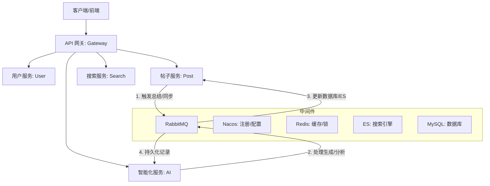

# MallChat Cloud - 高性能分布式微服务架构

基于 **Spring Cloud Alibaba** 深度构建的分布式微服务解决方案，采用最新的 **Java 21** 和 **Spring Boot 3.5.9**
技术栈。本项目旨在提供一套工业级的微服务架构模版，涵盖了从基础架构到上层业务的全方位最佳实践。

## 🌟 项目亮点

- **前沿技术栈**：全面拥抱 Java 21 特性，集成 Spring Boot 3.5.x 与 Spring Cloud 2025。
- **完善的微服务生态**：全方位的服务矩阵，包括 AI 服务、全文检索、实时通信等。
- **智能化增强**：集成 **LangChain4j** 大模型能力，支持多模型（DashScope/Ollama）并存与平滑切换。
- **AI 赋能业务**：支持**帖子自动总结**与**异步数据一致性**，通过 RabbitMQ 实现 AI 结果的稳健持久化。
- **高性能异步架构**：基于 RabbitMQ 实现对话记录持久化、搜索同步等关键流程，极大地提升了系统的响应并发。
- **全链路日志采集**：集成了详尽的操作日志、API 访问日志以及 AI Token 使用追踪体系，支持 ELK 日志收集。

## 🏗️ 架构概览



### 服务模块说明

| 模块名称                            | 功能描述                    | 端口   |
|:--------------------------------|:------------------------|:-----|
| `mallchat-gateway`              | API 网关：路由转发、鉴权、限流       | 8080 |
| `mallchat-user-service`         | 用户服务：账号、权限、多端登录         | 8081 |
| `mallchat-notification-service` | 通知服务：系统消息、实时推送          | 8083 |
| `mallchat-file-service`         | 文件服务：对象存储 (COS)         | 8085 |
| `mallchat-log-service`          | 日志服务：全链路日志采集与存储         | 8086 |
| `mallchat-mail-service`         | 邮件服务：验证码、告警发送           | 8087 |
| `mallchat-ai-service`           | AI 服务：LangChain4j 大模型集成 | 8089 |

## 🎯 技术栈

| 领域             | 核心技术                 | 版本           |
|:---------------|:---------------------|:-------------|
| Java 运行环境      | JDK                  | 21           |
| AI 框架          | LangChain4j          | 0.36.2       |
| 核心框架           | Spring Boot          | 3.5.9        |
| 微服务治理          | Spring Cloud Alibaba | 2023.0.3.2   |
| 服务网关           | Spring Cloud Gateway | 5.0.1        |
| 数据库            | MySQL                | 8.4.0        |
| 持久层框架          | MyBatis-Plus         | 3.5.12       |
| 缓存/分布式锁        | Redis & Redisson     | 7.0 / 3.48.0 |
| 消息队列           | RabbitMQ             | 3.12         |
| 通讯框架           | Netty                | 4.2.5.Final  |
| 认证鉴权           | Sa-Token             | 1.44.0       |
| 监控配置: Actuator | Spring Boot Actuator | 3.5.9        |

## 📮 消息队列 use 指南

项目通过 `mallchat-common-rabbitmq` 模块对 RabbitMQ 进行了封装，实现了**生产端统一发送**与**消费端自动化分发**。

### 1. 生产者 (Producer)

注入 `RabbitMqSender` 即可发送消息。

- **普通发送**：`mqSender.send(bizType, data)`
- **事务发送**：`mqSender.sendTransactional(bizType, data)`（当前实现为兼容历史 API，语义已降级为立即发送）。

### 2. 消费者 (Consumer)

1. **定义 Handler**：实现 `RabbitMqHandler<T>` 接口并注入为 Bean，标记 `@RabbitMqDedupeLock` 进行分布式去重。
2. **统一调度**：在具体的 `@RabbitListener` 中调用 `mqConsumerDispatcher.dispatch(rabbitMessage, channel, msg)`，系统将根据
   `bizType` 自动匹配 Handler 及其对应的 DTO 类型。

> 更多细节请参考 [RabbitMQ 模块文档](mallchat-common/mallchat-common-rabbitmq/README.md)。

## 🚀 快速启动

### 1. 基础环境

确保已安装 **Docker** 与 **Docker Compose**，在根目录下运行：

```bash
docker-compose up -d
```

这将启动 MySQL, Redis, RabbitMQ, Nacos, ES 等所有中间件。

### 2. 初始化数据库

参考 `sql/README.md` 执行相关数据库脚本。

### 3. 配置中心

1. 访问 Nacos 控制台 (默认 `localhost:8848/nacos`)。
2. 运行 `nacos-config/import-config.sh` (或手动导入) 导入配置文件。

### 4. 编译与运行

```bash
mvn clean install -DskipTests
# 启动各个 Service 模块的 Application 类
```

---

**维护者**: StephenQiu30  
**许可证**: [MIT License](LICENSE)
